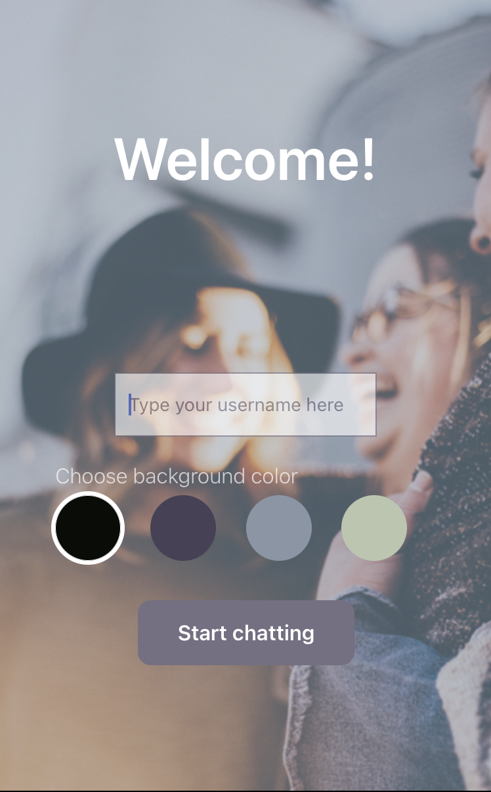

# Chat-App

## Objective
Chat-App is a mobile chat application built using React Native, Expo, and Google Firestore Database. It allows users to easily enter chat rooms, exchange messages, share images, and share their location with friends and family. The app also supports offline reading of messages and compatibility with screen readers for users with visual impairments.

## Skills/Languages Used
- React Native
- Expo
- JavaScript
- Firebase
- Firestore Database
- Firebase Authentication
- Firebase Cloud Storage
- Gifted Chat
- HTML/CSS (for styling)
- Node.js
- npm

## Key Features
- User authentication via Google Firebase anonymous sign-in.
- Ability to choose a background color for the chat screen.
- Real-time chat conversations stored in Firestore Database.
- Local storage and offline reading of messages.
- Image sharing: Users can select images from the device's library or take photos using the camera.
- Image storage in Firebase Cloud Storage.
- Location sharing: Users can share their current location in the chat using a map view.
- Chat interface and functionality provided by the Gifted Chat library.
- Mobile-responsive design and styling.

## Example Screenshot

